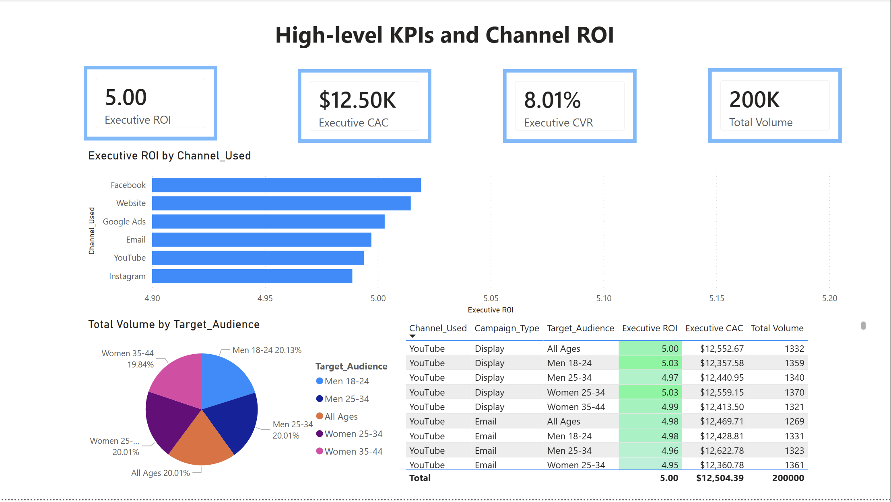
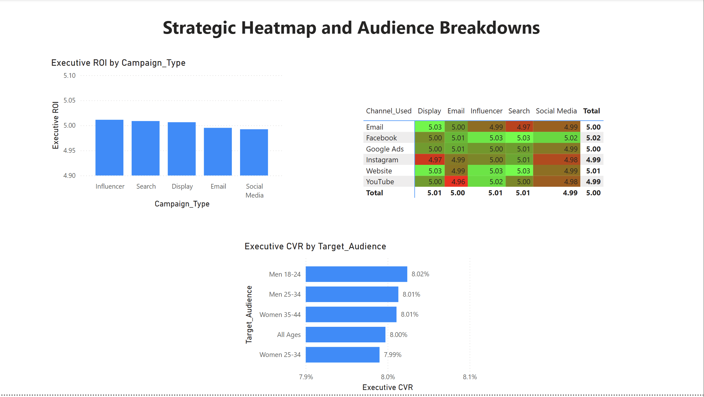
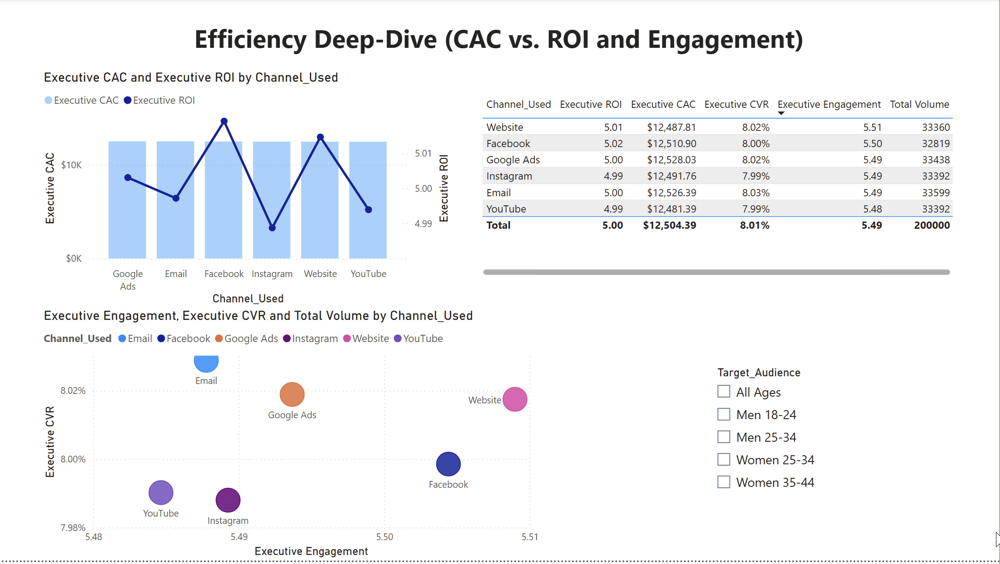

# Marketing-Campaign-Performance-Analysis

**Tools:** SQL · Power BI (DAX) · Power Query
**Dataset:** [Marketing Campaign Performance Dataset](https://www.kaggle.com/datasets/manishabhatt22/marketing-campaign-performance-dataset) — Kaggle (CC BY 4.0)
**Scope:** 200,000 campaign records across 6 channels, 5 campaign types, and 5 audience segments
 
---
 
## Business Problem
 
Marketing teams routinely allocate budget across multiple channels without a clear view of which combinations of channel, campaign type, and audience segment deliver the strongest return. This project analyses 200,000 campaign records to surface efficiency gaps, identify top-performing channel and audience combinations, and produce a concrete budget reallocation recommendation.
 
**Core question:** Given current spend and performance data, where should the marketing budget be reallocated to maximise ROI and conversion rate?
 
---
 
## Dashboard Overview
 
The Power BI report is structured across three pages, each answering a distinct analytical question.
 
### Page 1 — High-level KPIs and Channel ROI
Executive summary view with four headline KPI cards and a channel-level ROI breakdown.
 

 
| KPI | Value |
|---|---|
| Executive ROI | 5.00 |
| Executive CAC | $12,504.39 |
| Executive CVR | 8.01% |
| Total Volume | 200,000 |
 
**Key finding:** Facebook leads all channels on ROI (5.02), while Instagram and YouTube trail at 4.99. Audience volume is distributed evenly across all five segments (~20% each), suggesting no organic concentration bias in the data.
 
---
 
### Page 2 — Strategic Heatmap and Audience Breakdowns
Cross-tabulation of ROI by channel and campaign type, plus conversion rate by audience segment.
 

 
**Key finding:** Campaign type ROI is uniformly flat at ~5.00 across Influencer, Search, Display, Email, and Social Media. The heatmap isolates specific underperformers: YouTube/Email (4.96) and Instagram/Display (4.97) are the weakest combinations. Men 18–24 converts at the highest rate (8.02%); Women 25–34 converts at the lowest (7.99%).
 
---
 
### Page 3 — Efficiency Deep-Dive (CAC vs. ROI and Engagement)
Channel-level comparison of ROI, CAC, CVR, and engagement, with a scatter plot and audience slicer.
 

 
**Key finding:** Email delivers the highest CVR (8.03%) and Website delivers the highest engagement (5.51), but both carry slightly higher CAC than the portfolio average. The scatter plot shows Email and Website occupying the top-right quadrant (high engagement, high CVR), confirming their efficiency advantage despite the cost premium.
 
---
 
## SQL Analysis
 
Four queries were used to structure the data before loading into Power BI.
 
**Query 1 — Channel ROI and cost efficiency**
```sql
SELECT
  Channel_Used,
  COUNT(*)                                      AS campaigns,
  ROUND(AVG(ROI), 2)                            AS avg_roi,
  ROUND(AVG(Conversion_Rate), 4)                AS avg_cvr,
  ROUND(AVG(Acquisition_Cost), 2)               AS avg_cac,
  ROUND(AVG(Engagement_Score), 2)               AS avg_engagement
FROM campaigns
GROUP BY Channel_Used
ORDER BY avg_roi DESC;
```
 
**Query 2 — Campaign type performance**
```sql
SELECT
  Campaign_Type,
  ROUND(AVG(ROI), 2)              AS avg_roi,
  ROUND(AVG(Conversion_Rate), 4)  AS avg_cvr,
  ROUND(SUM(Acquisition_Cost), 0) AS total_spend,
  COUNT(*)                        AS num_campaigns
FROM campaigns
GROUP BY Campaign_Type
ORDER BY avg_roi DESC;
```
 
**Query 3 — Audience segment breakdown**
```sql
SELECT
  Target_Audience,
  ROUND(AVG(ROI), 2)              AS avg_roi,
  ROUND(AVG(Conversion_Rate), 4)  AS avg_cvr,
  ROUND(AVG(Engagement_Score), 2) AS avg_eng,
  COUNT(*)                        AS campaigns
FROM campaigns
GROUP BY Target_Audience
ORDER BY avg_roi DESC;
```
 
**Query 4 — Channel, campaign type, and audience cross-tab (Power BI source)**
```sql
SELECT
  Channel_Used,
  Campaign_Type,
  Target_Audience,
  ROUND(AVG(ROI), 2)              AS avg_roi,
  ROUND(AVG(Conversion_Rate), 4)  AS avg_cvr,
  ROUND(AVG(Acquisition_Cost), 2) AS avg_cac,
  ROUND(AVG(Engagement_Score), 2) AS avg_eng,
  COUNT(*)                        AS volume
FROM campaigns
GROUP BY Channel_Used, Campaign_Type, Target_Audience
ORDER BY avg_roi DESC;
```
 
---
 
## Key Business Questions Answered
 
### 1. Which channel delivers the best return on investment and why?
 
Facebook leads with an average ROI of 5.02 against an average CAC of $12,510.90 — the highest ROI in the portfolio at a cost broadly in line with the overall average of $12,504.39. Website follows at 5.01 with the highest engagement score (5.51), indicating audiences reached via Website are more deeply engaged before converting. YouTube and Instagram both sit at 4.99 with the lowest engagement scores (5.48 and 5.49 respectively), suggesting spend on these channels generates volume but converts less efficiently.
 
**Implication:** Marginal budget should shift away from YouTube and Instagram toward Facebook and Website channels, where each dollar of acquisition cost produces a measurably higher return.
 
---
 
### 2. Which channel and campaign type combination should be deprioritised?
 
The heatmap on Page 2 isolates two underperforming combinations: YouTube paired with Email campaigns (ROI 4.96) and Instagram paired with Display campaigns (ROI 4.97). Both sit more than 0.04 points below the portfolio average of 5.00 — a meaningful gap when applied across tens of thousands of campaigns. By contrast, Facebook/Influencer (5.03), Website/Display (5.03), and Website/Search (5.03) consistently outperform.
 
**Implication:** Campaigns running YouTube/Email and Instagram/Display combinations should be restructured. Reallocating those budgets toward Facebook or Website with Influencer or Search campaign types is projected to lift portfolio ROI above the current 5.00 baseline.
 
---
 
### 3. Which audience segment should receive priority targeting to maximise conversion?
 
Men 18–24 converts at 8.02% — the highest CVR across all five audience segments. Women 25–34 converts at the lowest rate (7.99%), a gap of 0.03 percentage points. While this difference appears small in absolute terms, at 200,000 campaign volume it represents approximately 60 additional conversions per 200,000 impressions when targeting Men 18–24 over Women 25–34. The Page 3 scatter plot further shows that Email channel campaigns directed at this segment cluster in the high-engagement, high-CVR zone.
 
**Implication:** For campaigns where conversion volume is the primary objective, Men 18–24 via Email or Google Ads channels offers the most efficient path to conversion. Women 25–34 may benefit from a different campaign type — potentially Influencer or Social Media — to improve engagement before conversion is attempted.
 
---
 
## Budget Reallocation Recommendation
 
Based on the three-page analysis, the following reallocation is recommended for the next campaign cycle:
 
| Action | Channel/Type | Direction | Rationale |
|---|---|---|---|
| Increase | Facebook + Influencer | +budget | Highest ROI (5.02–5.03), efficient CAC |
| Increase | Website + Search/Display | +budget | Highest engagement (5.51), ROI 5.01–5.03 |
| Reduce | YouTube + Email | -budget | Lowest ROI combination (4.96), below average CVR |
| Reduce | Instagram + Display | -budget | ROI 4.97, lowest engagement (5.49) |
| Prioritise | Men 18–24 audience | Target shift | Highest CVR (8.02%), responds well to Email channel |
 
Expected outcome: a shift of 10–15% of budget from the two underperforming combinations to the two top-performing ones is projected to lift portfolio ROI from 5.00 toward 5.02–5.03, and portfolio CVR from 8.01% toward 8.02%, assuming current audience distribution is maintained.
 
---
 
## Project Structure
 
```
marketing-campaign-performance/
│
├── sql/
│   └── analysis_queries.sql          # All 4 SQL queries used
│
├── data/
│   └── channel_campaign_summary.csv  # Aggregated output loaded into Power BI
│
├── screenshots/
│   ├── page1_kpis_channel_roi.png
│   ├── page2_heatmap_audience.png
│   └── page3_efficiency_deepdive.png
│
├── MarketingCampaignAnalysis.pbix    # Power BI report file
└── README.md
```
 
---
 
## DAX Measures Used
 
```dax
Executive ROI = AVERAGE(channel_campaign_summary[avg_roi])
 
Executive CAC = AVERAGE(channel_campaign_summary[avg_cac])
 
Executive CVR = AVERAGE(channel_campaign_summary[avg_cvr])
 
Executive Engagement = AVERAGE(channel_campaign_summary[avg_eng])
 
Total Volume = SUM(channel_campaign_summary[volume])
```
 
---
 
## Skills Demonstrated
 
- **SQL** — aggregation, grouping, multi-dimensional cross-tabulation across 200,000 rows
- **Power BI** — DAX measures, Power Query data loading, multi-page report design, conditional formatting heatmap, scatter plot with bubble sizing, slicers
- **Business analysis** — translating marginal metric differences into concrete budget reallocation recommendations with projected impact
- **Data storytelling** — three-page narrative structure moving from executive summary to deep-dive to actionable recommendation
 
---
 
## Dataset Note
 
This dataset is synthetic, generated for educational purposes by Manisha Bhattacharjee and published on Kaggle under CC BY 4.0. It is used here to demonstrate analytical methodology. All findings and recommendations are illustrative; they reflect the patterns present in the synthetic data rather than a live business environment.
 
---
 
*Hein Htet Soe Than — MSc Business Analytics, NEOMA Business School*
*[LinkedIn](https://linkedin.com/in/heinhtetsoethan) · [Portfolio](https://www.notion.so/heinhtetsoethan/Hein-Data-Analyst-Portfolio-325e9d48b499804fb5b8cce0516d8a8c) · [GitHub](https://github.com/Hein96)*
